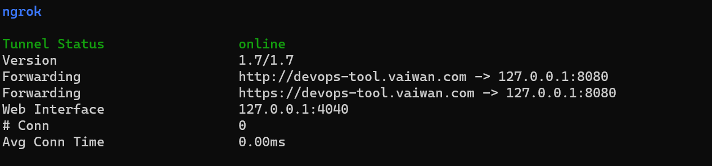
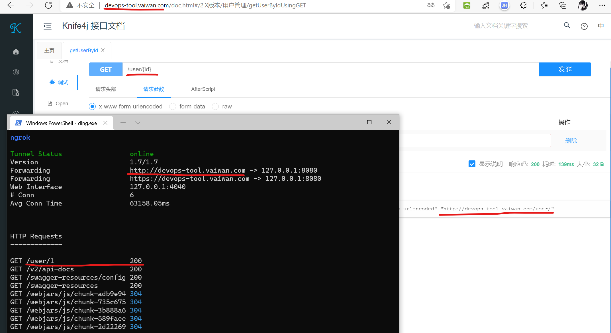
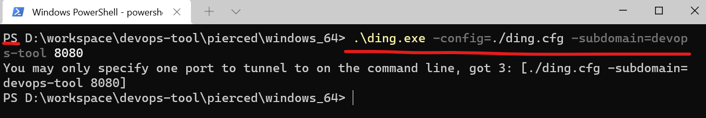

本目录来源于—https://github.com/open-dingtalk/pierced。

内网穿透的工具很多，这个感觉比较方便，不用安装即可实现内网穿透，特意迁移到gitee。

我目前只在windows上使用过，特记录如下：
* 进入windows_64目录
* 执行命令
    ```
    ding.exe -config=./ding.cfg -subdomain=devops-tool 8080
    ```

    - 自定义域名：devops-tool
    - 本地目标端口：8080

    

    

注意：

  * window上使用powershell执行穿透命令会报错
  
    这是powershell不兼容该程序造成的，使用cmd执行即可。

    
  * 使用https访问会失败
    
    同样的疑问在此：https://github.com/open-dingtalk/pierced/issues/23