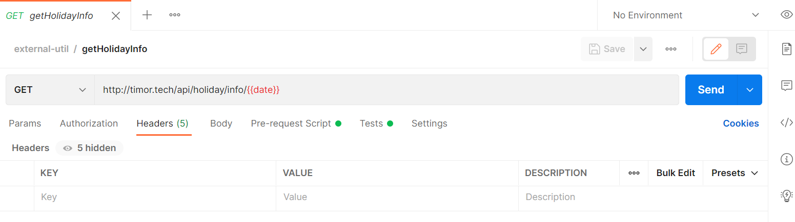
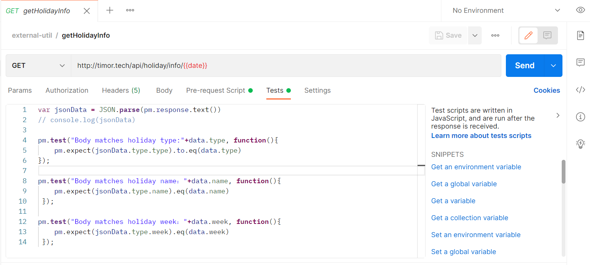
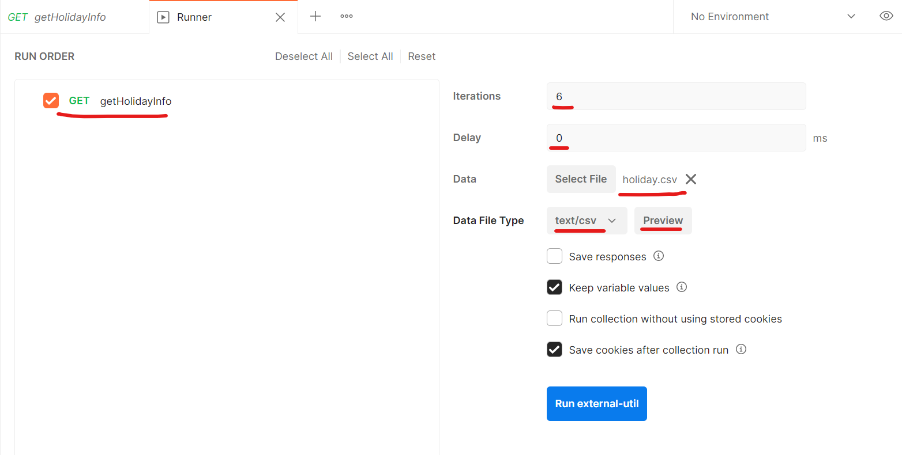
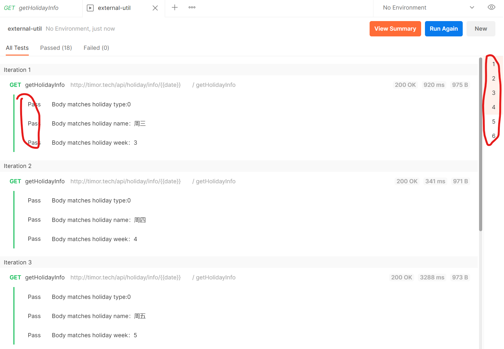

# Running collections with data file via Newman
## 一、postman设置

* api-url:
  
  get  http://timor.tech/api/holiday/info/{{date}}


* Pre-request Script

    

* Tests

    

    ```js
    var jsonData = JSON.parse(pm.response.text())
    // console.log(jsonData)

    pm.test("Body matches holiday type:"+data.type, function(){
        pm.expect(jsonData.type.type).to.eq(data.type)
    });

    pm.test("Body matches holiday name："+data.name, function(){
        pm.expect(jsonData.type.name).eq(data.name)
    });

    pm.test("Body matches holiday week："+data.week, function(){
        pm.expect(jsonData.type.week).eq(data.week)
    });
    ```

## 二、准备数据
holiday.csv
```csv
date,type,name,week
2021-8-18,0,周三,3
2021-8-19,0,周四,4
2021-8-20,0,周五,5
2021-8-21,1,周六,6
2021-8-22,1,周日,7
2021-8-23,0,周一,1
```

## 三、使用runner 执行collection
选择数据文件、迭代次数、迭代间隔时间
 

查看断言结果
 

## 四、使用docker 执行collection（data file）

```shell
 # holiday.csv 在目录D:\workspace\devops-tool\postman下，这里必须挂载/etc/newman目录，否则找不到文件
 # --iteration-data 也可以简写-d
 # -n（可选） 可以指定迭代次数，我这里holiday.csv里面有6行数据，这里指定-n 1就是只执行第一行数据
 docker run --rm -v D:\workspace\devops-tool\postman:/etc/newman -t postman/newman run "https://www.getpostman.com/collections/4e3cd81f88616d487f6c"  --iteration-data holiday.csv -n 1
```

通常来说，一个collection里面接口不止一个，但是-d 只能指定一个数据文件(*.csv/*.json)，如果多个接口需要使用数据文件，可以指定`--folder <name>`命令，比如
```shell
docker run --rm -v ${pwd}:/etc/newman -t postman/newman run "https://www.getpostman.com/collections/4e3cd81f88616d487f6c" --folder <name> --iteration-data holiday.csv -n 1
```
更多newman cli 命令参考资料如下：
* [Running collections on the command line with Newman](https://learning.postman.com/docs/running-collections/using-newman-cli/command-line-integration-with-newman/)
* [Run collections with file uploads using Newman](https://blog.postman.com/run-collections-with-file-uploads-using-newman/)

参考：
* [postman 详细使用 (4)：导入 csv、json 外部数据](https://blog.csdn.net/Al_assad/article/details/81370183)
* [Using CSV and JSON Data Files in the Postman Collection Runner](https://blog.postman.com/using-csv-and-json-files-in-the-postman-collection-runner/)
* [Looping through a Data File in the Postman Collection Runner](https://blog.postman.com/looping-through-a-data-file-in-the-postman-collection-runner/)