# nocodb使用说明
## 一、nocodb安装
### 1 - docker、sqlite运行nocodb
```shell
# nocodb默认使用sqlite存储数据，0.10.6版本后数据目录为：/usr/app/data/
docker run -d --name nocodb -v nocodb-data:/usr/app/data/ -p 8080:8080 nocodb/nocodb

#或使用docker-compose
docker-compose up -d
```

### 2 - docker-compose、mysql运行nocodb
具体内容参见docker-compose-mysql.yaml

```shell
docker-compose -f .\docker-compose-mysql.yaml up -d
```

### 3 - docker-compose、postgres运行nocodb
具体内容参见docker-compose-postgres.yaml

```shell
docker-compose -f .\docker-compose-postgres.yaml up -d 
```

## 二、配置nocodb
* 初始化页面
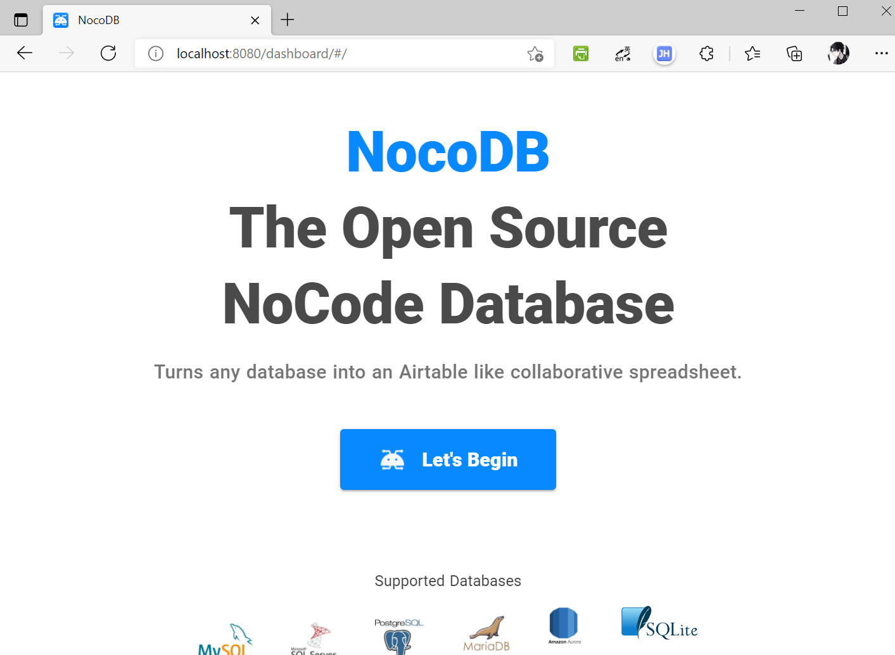

* 注册账户
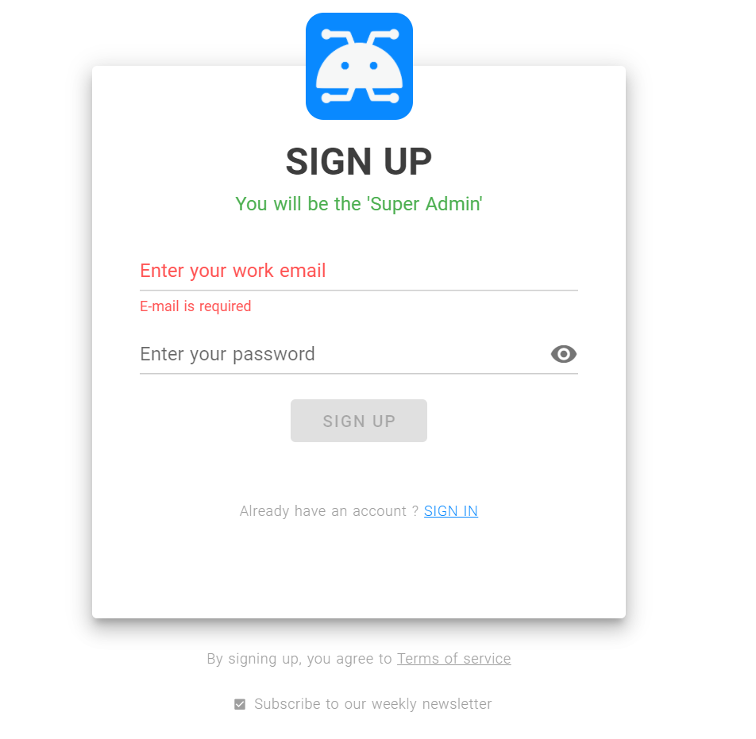

* 创建项目

  其实就是把mysql指定数据库（这里是fund-db)通过nocodb暴露出来
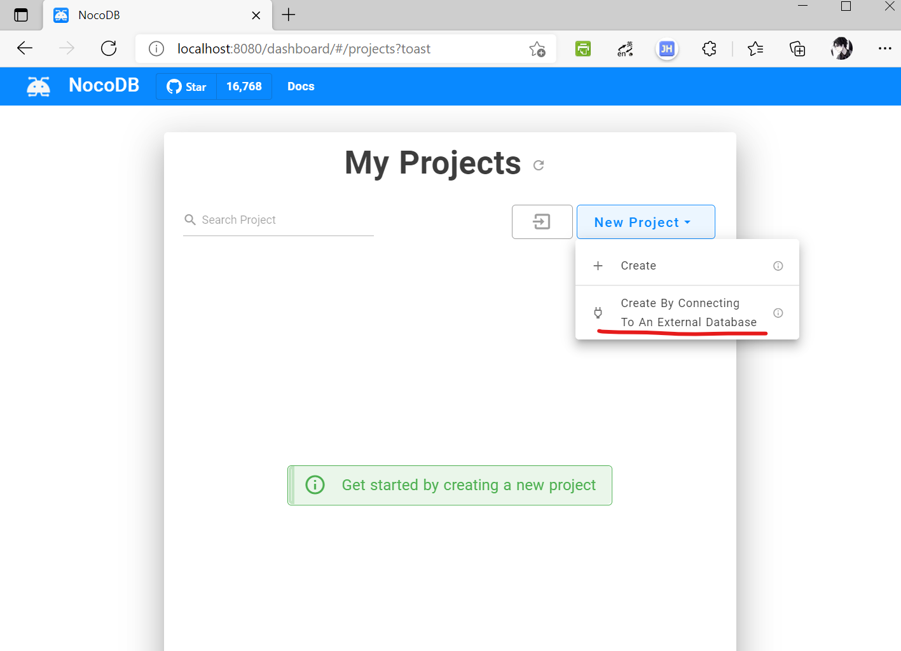

* 测试链接

  连接成功后，可以直接在nocodb中管理mysql数据库
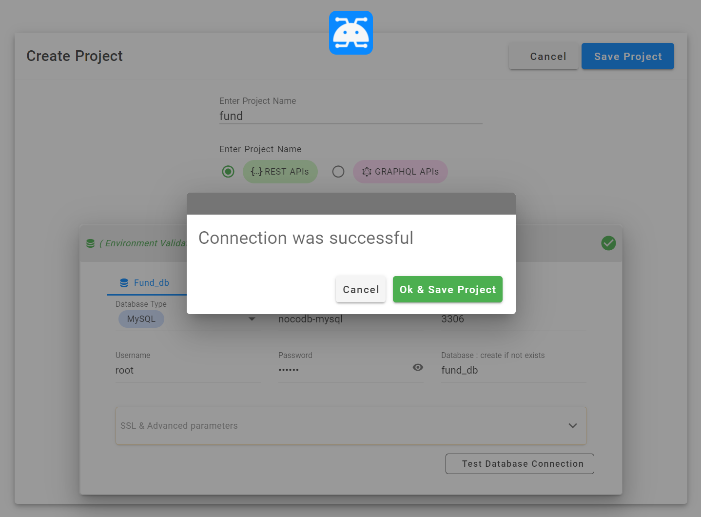

* 连接成功

  连接成功后既可以将mysql数据库中表和数据展示出来，更多功能还需自行探索。

  ps：注意右上角，点击`Copy auth token`，得到的token值将在后续api访问时通过http request header 的键`xc-auth`。
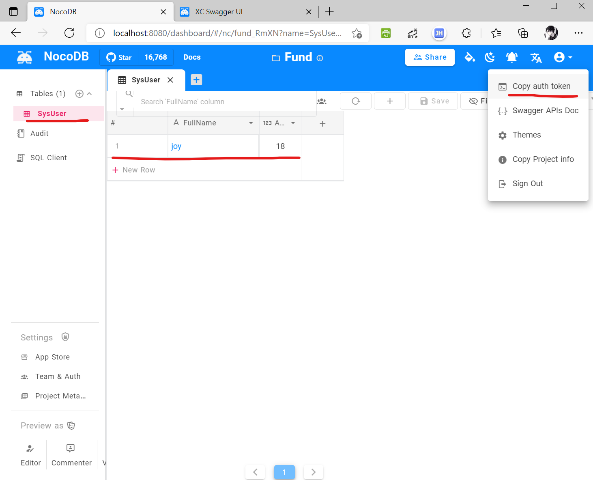

## 三、通过api访问mysql数据
### 1 - 在nocodb中swagger页面访问mysql数据
* nocodb swagger
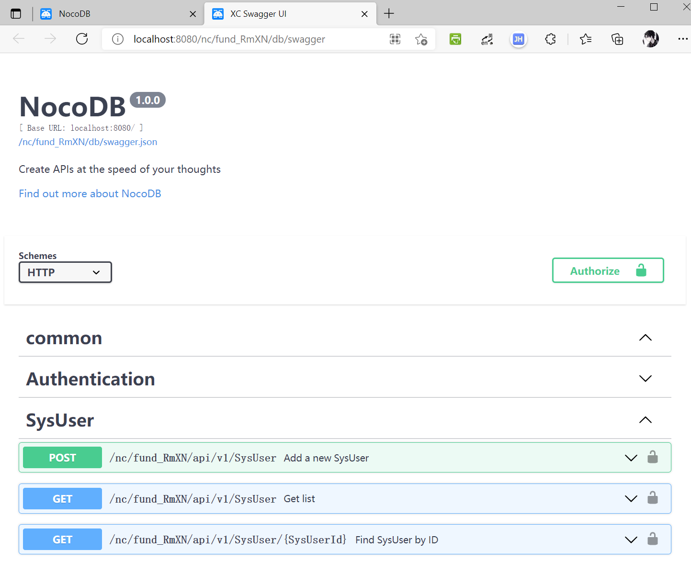

* api 接口授权
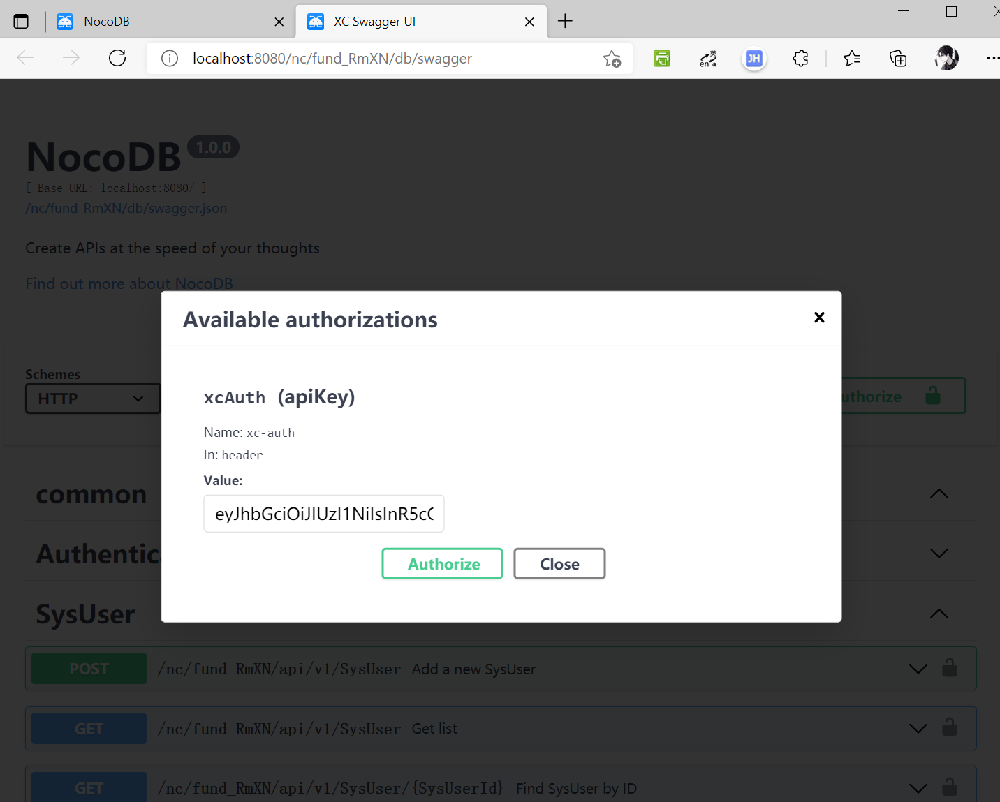

* 通过nocodb接口获取指定数据表所有数据

  更多api操作，详见参考链接
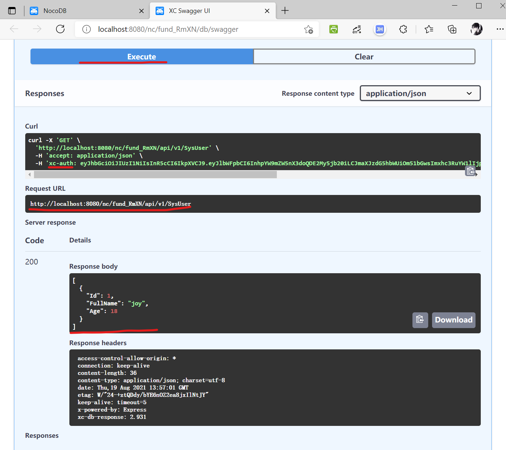
### 2 - 在postman中通过nocodb访问mysql数据
由于本地没有安装postman，这里使用的是postman浏览器版（官网注册/登陆即可）

* 设置api请求路径、参数

  注意观察请求头，添加了xc-auth键值  
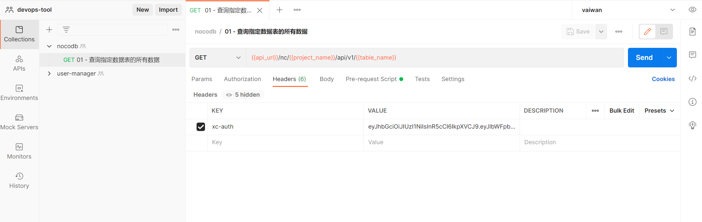

* 发送请求

  为了通用，api_url、project_name和table_name都使用了变量（前者为vaiwan中定义的环境变量，后者为集合变量）。
  注意观察请求结果，与前面swagger中返回一致。
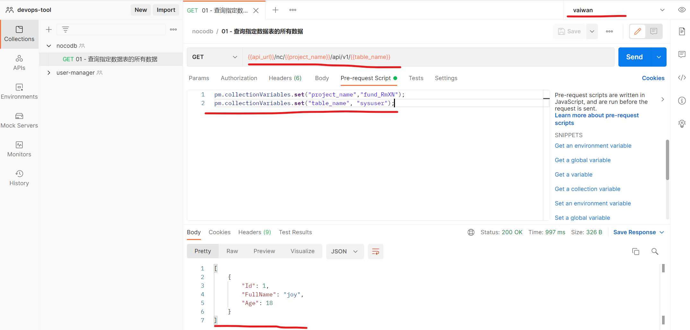

* 内网穿透（可选）

  因为使用了postman web app来模拟请求，nocodb又是直接部署在本地的。如果nocodb有外网地址或者本地安装了postman，这步可以省略。

  注意：上面的请求路径也被记录下来，403和200分别是添加xc-auth请求头前后的请求结果。
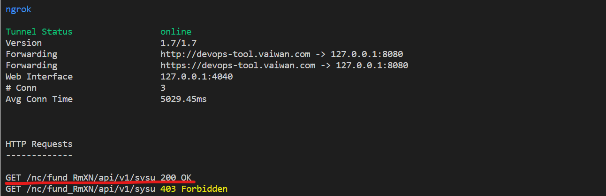

参考：
* [nocodb APIs Access](https://docs.nocodb.com/setup-and-usages/apis-access)
* [nocodb REST APIs](https://docs.nocodb.com/developer-resources/rest-apis)
